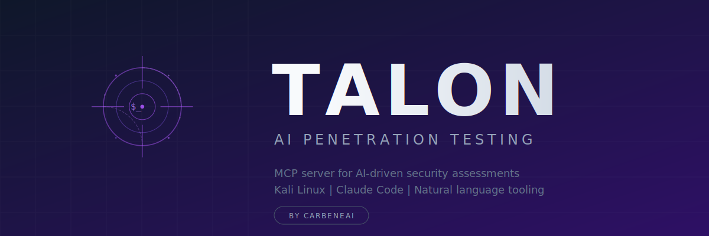

<p align="center">
  
</p>

# Talon

**Penetration Testing MCP for Claude Code**


Talon connects Claude Code to a Kali Linux (or any pentesting) VM via SSH MCP, enabling AI-assisted penetration testing with automated recon, structured enumeration, and professional reporting — all from your terminal.

---

## What It Does

Talon packages the `@anthropic-ai/mcp-server-ssh` server with a complete penetration testing methodology:

- **AI-directed recon** — Ask Claude to run nmap, gobuster, or nikto and get structured analysis
- **Automated 5-phase reconnaissance** — Port discovery, service enumeration, web scanning, SMB, UDP
- **13-service enumeration guide** — Comprehensive commands for every common service
- **OSCP-style report template** — Professional reporting structure for client and certification use
- **Obsidian vault integration** — Engagement and target note templates for organized documentation

The key insight: Claude can execute commands on your Kali VM, interpret the output, suggest next steps, and maintain a complete attack narrative — without leaving your editor.

---

## Features

| Feature | Description |
|---------|-------------|
| SSH MCP connection | Claude Code runs commands directly on your pentest VM |
| Automated recon | 5-phase bash script covering all initial recon steps |
| Service enumeration | 13 services: FTP, SSH, SMB, HTTP, Kerberos, LDAP, MSSQL, MySQL, RDP, WinRM, Redis, PostgreSQL, SMTP |
| Report generation | OSCP-style template with findings, evidence, and remediation structure |
| Obsidian templates | Engagement tracker and per-target notes with attack path mermaid diagrams |
| Dark workflow | Built for terminal-first, low-noise operation |

---

## Requirements

- [Claude Code](https://claude.ai/code) installed and running
- SSH access to a Kali Linux (or other pentesting) VM
- Node.js / npx (for the MCP server)
- Target systems you have explicit authorization to test

---

## Quick Start

### 1. Install the SSH MCP Server

```bash
# No global install needed — npx handles it at runtime
# Verify npx is available:
npx --version
```

### 2. Configure Your SSH Connection

Copy the example config to your Claude Code MCP config:

```bash
cp mcp-config.example.json ~/.claude/mcp.json
# Then edit with your actual SSH host and username
```

Or add the `kali-ssh` entry to your existing `mcp.json`:

```json
{
  "mcpServers": {
    "kali-ssh": {
      "command": "npx",
      "args": [
        "-y",
        "@anthropic-ai/mcp-server-ssh",
        "ssh://YOUR_USERNAME@YOUR_KALI_IP"
      ],
      "description": "Kali Linux pentesting VM for security testing"
    }
  }
}
```

### 3. Set Up SSH Key Auth

Talon works best with key-based authentication (no password prompts):

```bash
# Generate a key if you don't have one
ssh-keygen -t ed25519 -C "claude-code-pentest"

# Copy to your Kali VM
ssh-copy-id YOUR_USERNAME@YOUR_KALI_IP

# Test the connection
ssh YOUR_USERNAME@YOUR_KALI_IP "uname -a"
```

### 4. Copy Recon Script to Your VM

```bash
scp scripts/recon.sh YOUR_USERNAME@YOUR_KALI_IP:~/recon.sh
ssh YOUR_USERNAME@YOUR_KALI_IP "chmod +x ~/recon.sh"
```

### 5. Start Testing

Open Claude Code and start asking:

- "Run a full recon on 10.10.10.100 using Kali"
- "Enumerate SMB shares on the target"
- "Check for web vulnerabilities on http://10.10.10.100"
- "Run linpeas and analyze the output"
- "Generate a pentest report for this engagement"

See `docs/usage.md` for complete workflow examples.

---

## Repository Structure

```
Talon/
├── mcp-config.example.json      # Template MCP config — copy and edit
├── .env.example                 # SSH environment variables template
├── CLAUDE.md                    # Claude Code project instructions
├── scripts/
│   └── recon.sh                 # Automated 5-phase reconnaissance
├── references/
│   ├── service-enum.md          # Per-service enumeration commands (13 services)
│   └── report-template.md       # OSCP-style report template
├── templates/
│   ├── engagement.md            # Obsidian engagement tracker
│   └── target.md                # Obsidian per-target notes
└── docs/
    ├── setup-kali.md            # Kali VM setup guide
    ├── ssh-access.md            # SSH tunnel and VPN access methods
    └── usage.md                 # Usage examples and workflows
```

---

## Methodology

Talon follows a structured 5-phase approach:

```
1. RECON  →  2. ENUM  →  3. EXPLOIT  →  4. POST-EXPLOIT  →  5. REPORT
     |             |            |               |                  |
  Passive      Services     Initial          PrivEsc           Document
  + Active     + Vulns      Access           + Loot            Findings
```

The `scripts/recon.sh` script automates Phase 1 and feeds directly into Phase 2 using the `references/service-enum.md` guide.

---

## Example Prompts for Claude

Once the MCP server is connected, try these prompts:

```
# Initial recon
"Run the recon script on 10.10.10.50 and tell me what's interesting"

# Service deep dive
"Port 445 is open. Enumerate SMB using null session and check for vulnerabilities"

# Web testing  
"The target has a web server on port 80. Run a full web enumeration and check for common vulns"

# Post-exploitation
"I have a shell as www-data. Run linpeas and identify privilege escalation paths"

# Reporting
"Summarize all findings from this session into a professional report"
```

---

## Security and Ethics

**This tool is for authorized security testing only.**

- Always obtain written authorization before testing any system
- Never use against systems you do not own or have explicit permission to test
- Comply with your local laws and the terms of any bug bounty programs
- Store engagement data securely and dispose of it properly after completion

---

## Obsidian Integration

Talon includes Obsidian-compatible templates for maintaining organized pentest notes:

1. Copy `templates/engagement.md` to your Obsidian vault as a new note
2. Copy `templates/target.md` for each machine you test
3. Link targets from the engagement note for a connected knowledge graph

The templates use Obsidian callouts, mermaid diagrams, and checkbox lists for efficient note-taking during active engagements.

---

## Related Projects

- [PAI (Personal AI Infrastructure)](https://github.com/CarbeneAI/PAI) — The open-source AI infrastructure system Talon was extracted from
- [@anthropic-ai/mcp-server-ssh](https://www.npmjs.com/package/@anthropic-ai/mcp-server-ssh) — The underlying SSH MCP server

---

## Contributing

Pull requests welcome. Focus areas:

- Additional service enumeration guides
- Report template variants (PTES, bug bounty, etc.)
- Obsidian workflow improvements
- Additional automation scripts

---

## License

MIT License. Copyright 2026 CarbeneAI.

See [LICENSE](./LICENSE) for full text.

---

*Built by [CarbeneAI](https://carbene.ai) — Security Built In, Not Bolted On.*
