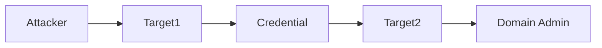

# {{title}} Engagement

## Overview

**Type:** Lab / CTF / Client Engagement
**Network:** `TARGET_NETWORK/24`
**VPN:** 

## Targets

| Machine | IP | OS | Status | User | Root |
|---------|----|----|--------|------|------|
| [[Target1]] | TARGET_IP_1 | Linux | ⏳ | ❌ | ❌ |
| [[Target2]] | TARGET_IP_2 | Windows | ⏳ | ❌ | ❌ |
| [[Target3]] | TARGET_IP_3 | Unknown | ⏳ | ❌ | ❌ |

**Legend:** ✅ Complete | 🔄 In Progress | ⏳ Not Started | ❌ Not Achieved

## Credentials Found

| Username | Password/Hash | Machine | Valid On |
|----------|--------------|---------|----------|
|  |  |  |  |

## Attack Path

## Notes

- 

## Timeline

| Date | Activity | Target | Result |
|------|----------|--------|--------|
| {{date}} | Started engagement | - | - |
|  |  |  |  |

## Flags / Proofs

| Machine | User Flag | Root Flag |
|---------|-----------|-----------|
|  |  |  |

## Lessons Learned

### What Worked
- 

### What Did Not Work
- 

### New Techniques Learned
- 
